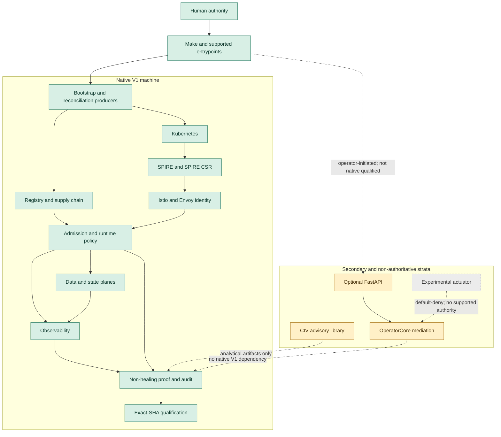

# TruthFast System Atlas

This is the canonical reviewer entrypoint for the implemented V1 machine. The
row-level model is under [`system-model/`](system-model/README.md); the complete
dated archaeology is retained as a forensic snapshot, not current authority.

## What TruthFast Is

TruthFast V1 is an executable assurance reference system. It binds
source-defined intent to producer-converged runtime state, then evaluates that
state through workload identity, enforcement, deliberate positive and negative
execution, observability, integrity-bound evidence, semantic determinism, and
exact-source qualification.

Its distinguishing property is the joined justification chain:

```text
SOURCE
-> PRODUCER-OWNED CONVERGENCE
-> RUNTIME STATE
-> IDENTITY AND ENFORCEMENT
-> OBSERVATION
-> NON-HEALING EXECUTABLE PROOF
-> INTEGRITY-BOUND EVIDENCE
-> EXACT-SHA QUALIFICATION
```

The machine is the primary application. TruthFast is not primarily an AI
application, autonomous operator, OperatorCore deployment, CIV library,
dashboard, or loose collection of Kubernetes security components.

## Architecture in 60 Seconds



The mandatory V1 closure is human authority, host contract, supported Make
entrypoints, bootstrap producers, Kind/Kubernetes, the internal registry and
supply chain, SPIRE, SPIRE CSR, Istio/Envoy, Kyverno/RBAC/network policy,
data/state planes, observability, proof/audit, and exact-SHA qualification.

## Identity and Trust

- SPIRE is workload identity authority.
- cert-manager is auxiliary and does not issue workload identity.
- Signing keys cannot synthesize workload identity.
- Authority defaults to `UNCLAIMED` until validated identity establishes it.
- Raw `x-spiffe-id` is not canonical API identity.
- The optional API requires sanitized, proxy-produced XFCC when deployed.
- Istio/Envoy binds transport identity; application parsing does not replace
  transport authentication.

## Authority and Mutation

Producers own state. Bootstrap and controllers reconcile canonical runtime
objects. Consumers, proof, and certification witness produced state rather than
repairing it.

Canonical proof is non-healing assurance with bounded active checks. It may
write evidence and create/remove controlled fixtures, but it must not reconcile
or heal the canonical producer state it judges. Active checks remain explicitly
classified and cannot be converted into passive PASS claims.

CIV has no supported activation authority. The retained actuator/actuation
layers are experimental, default-deny strata, not V1 execution authority.

## Supply Chain

The source inventory defines the managed image set. Build/preload producers put
the corresponding digests into the local TLS registry; signing producers bind
signatures; admission verifies policy; runtime imageID reconciliation confirms
the running projection. A running pod alone is not a supported system.

## Proof and Evidence

The proof truth model preserves `PASS`, `FAIL`, `BLOCKED`, and
`NOT_EVALUATED` as distinct states. It records passive and active aggregates,
declares that proof does not heal canonical state, signs evidence, and verifies
semantic projections.

Determinism means canonical/semantic projection determinism. It does not mean
bitwise identity of timestamps, UUIDs, signatures, logs, pod names, or IPs.
Signed evidence proves integrity and binding; the verifier chain is still
required to justify runtime truth.

## Observability

OpenTelemetry, Prometheus, Loki/Promtail, Tempo, Grafana, and the notifier form
the native signal path. They observe and correlate behavior; they do not create
runtime authority. Control-plane Prometheus scrapes use Kubernetes
service-account authentication, the mounted Kubernetes CA, and stable service
routing without TLS bypass.

## Native, Secondary, and Historical

`CLASSIFICATION` describes responsibility. `SUPPORT_TIER` and
`QUALIFICATION_SCOPE` answer the separate release question.

| Surface | Support tier | Qualification scope | Meaning |
| --- | --- | --- | --- |
| Native infrastructure, identity, policy, data, observability, proof | `SUPPORTED_V1` | `NATIVE_V1_QUALIFIED` | Part of the exact-SHA V1 machine |
| Four reviewer demo systems | `SUPPORTED_V1` | `SUPPORTED_DEMO` | Supported demonstrations, not independent proof authority |
| Optional FastAPI, API boundary, OperatorCore, operator ledger | `SECONDARY` | `SECONDARY_UNQUALIFIED` | Source-canonical secondary application closure; not native cold-start qualified |
| CIV Python advisory library | `ADVISORY` | `SOURCE_ONLY` | Non-authoritative decision/provenance library |
| Actuator and labs | `EXPERIMENTAL` | `SOURCE_ONLY` | No supported V1 mutation authority |
| Qdrant/vector and K3/VM paths | `COMPATIBILITY` | `SOURCE_ONLY` | Explicit non-native compatibility strata |
| Ironman, archives, alternate GitOps mirrors | `HISTORICAL` | `HISTORICAL` | Retained context; not native producer authority |

OperatorCore is a **secondary application mediation kernel**. It is real and
identity/governance/ledger aware, but Golden Boot, native bootstrap, and the
four supported demos do not depend on or deploy it.

## Supported Entrypoints

The machine authority is
[`platform/config/support_contract.json`](https://github.com/computeaholic/TruthFast/blob/main/platform/config/support_contract.json).
The supported V1 set is exactly:

`audit`, `demo`, `demo-all`, `demo-authority-contrast`, `demo-civ`,
`demo-security-boundary`, `forgesec`, `golden-boot`, `proof`,
`prove-spire-outage`, `registry-audit`, `validate-all`, and `verify-main`.

The supported demos are exactly `demo`, `demo-civ`,
`demo-authority-contrast`, and `demo-security-boundary`; `demo-all` is their
source-clean aggregate.

`runtime-deploy-api` is secondary, not native V1 qualified, and not cold-start
supported. It requires an explicit operator acknowledgement and externally
provisioned application prerequisites; it cannot synthesize authority or
credentials.

## Evidence and Navigation

- [Machine-readable model](system-model/README.md)
- [Canonical proof contract](../CANONICAL/PROOF_CONTRACT.md)
- [Native reference implementation](11-Native-Reference-Implementation.md)
- [Concept ownership index](17-Concept-Index.md)
- [Post-V1 architectural assets](POST_V1_ARCHITECTURAL_ASSETS.md)
- [Public release provenance](../releases/PUBLIC_RELEASE_PROVENANCE.md)
- Historical forensic snapshots remain in the private ThreadForge engineering repository and are not part of this clean public source export.

The machine-readable claim graph is descriptive/reference metadata in V1. It is
not a new qualification authority.

The [engineering doctrine](ENGINEERING_DOCTRINE.md) records the concise review
principles applied to this machine. The complete research source and
[machine-readable A-AI mapping](system-model/research_doctrine_matrix.json) are
descriptive research records. They do not create new V1 support obligations or
replace the project obligation ledger.

## Qualification Delta

The complete forensic snapshot remains bound to its original observation
points and is not rewritten after repair:

- original atlas review SHA: `8f6401e14a62c501553665a2219bcc4b40eb6049`;
- original runtime-qualified SHA: `219de001a82e4de584ea363057c8f68d2fe550bb`;
- prior V1 runtime-qualified SHA: `34082cfb4e3b0173f09dc7aeabfa7abb5ad201aa`;
- final current V1 runtime-qualified SHA: `0ddae102badf2a93fe4fdb3934ad9a36db4c8c84`;
- atlas defects identified: `3`;
- atlas defects closed: `3`;
- atlas defects remaining: `0`.

The final executable revision closed support-tier ambiguity, authenticated and
TLS-verified the Prometheus control-plane scrape paths with exact RBAC, and
made passive versus bounded active proof semantics explicit. Exact-SHA Golden
Boot, both supported-demo aggregates, the controlled SPIRE outage, isolated
proof tamper rejection, registry audit, canonical audit, and `verify-main`
subsequently passed on that revision.

## Current Boundaries

TruthFast V1 does not claim production readiness, HA certification,
universal portability, independent external audit, external immutable audit
anchoring, autonomous remediation, or universal fail-closed behavior outside
the constructed and tested boundaries. Its primary limitations are operational
portability, HA/key/state continuity, and repository complexity.

Trust rotation evidence establishes successor publication, acceptance by
load-bearing Istio/Envoy consumers, and current-lineage convergence. V1 does not
independently claim that every relying consumer rejects every retired
predecessor. It also does not claim universal evaluator-version provenance,
structural verifier budgets, credential-consumer intent, capability minimality,
or privilege necessity.

## Historical Evolution

The retained source records a bounded evolution: autonomous operator ideas
became envelope/OperatorCore mediation and bounded authority; actuation became
default-deny experimental strata; simulation became CIV deterministic
provenance and counterfactual analysis without activation; security demos
became executable negative assurance and exact-source qualification. Historical
material explains lineage but does not acquire current authority.
